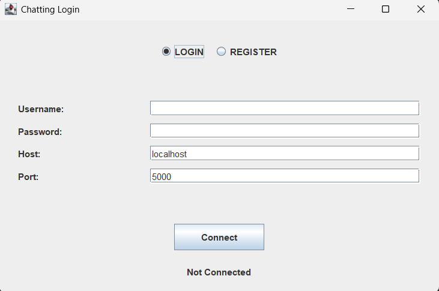
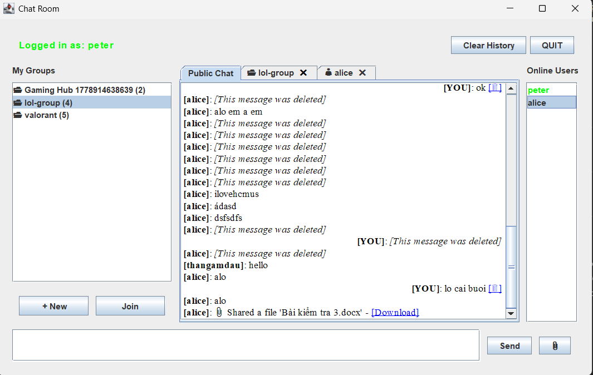
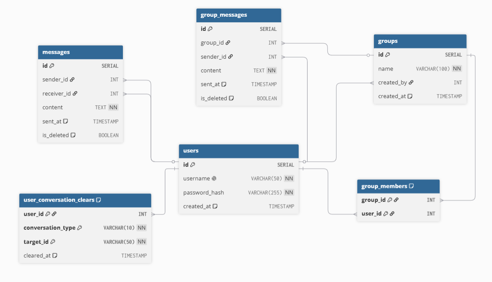

# Java Chat Application

A multi-client desktop chat application built with Java, featuring real-time messaging over TCP sockets, a Swing GUI, a structured text-based protocol, and PostgreSQL persistence.

## Table of Contents

- [Introduction](#introduction)
- [Features](#features)
- [System Requirements](#system-requirements)
- [Installation & Setup](#installation--setup)
- [Usage](#usage)
- [Project Structure](#project-structure)
- [Tech Stack](#tech-stack)
- [Demo / Screenshots](#demo--screenshots)
- [Database Schema](#database-schema)

---

## Introduction

This project is a Java programming course assignment that builds a fully functional multi-client chat system from the ground up — starting from raw TCP sockets and progressing through threading, GUI design, protocol engineering, and database persistence.

- **Purpose:** Learn Java networking, concurrency, Swing GUI, and JDBC through a real-world application.
- **Context:** University course project — Java Programming, HCMUS.
- **Problems solved:** How to handle many simultaneous clients, how to design a structured messaging protocol, how to persist chat history in a relational database, and how to keep the GUI responsive while networking runs in the background.

---

## Features

**Chat Application Assignment Requirements:**

- ✅ User registration from the client application, and login after registration.
- ✅ A user can chat with multiple other online users simultaneously (Public Chat / Broadcast).
- ✅ Users can create group chats and chat within these groups.
- ✅ File transfer capabilities during a chat (both group and private).
- ✅ View personal chat history, clear whole conversations, and delete individual messages (fully persistent across logins).
- ✅ Elegant Tabbed Interface with closable conversation tabs (double-click online users or groups to open tabs).

*(Optional features not currently required: voice chat, webcam).*

---

## System Requirements

### Software

| Requirement | Version |
|---|---|
| Java JDK | 24+ (OpenJDK recommended) |
| PostgreSQL | 14+ |
| IDE | IntelliJ IDEA (recommended) |

### External JARs (add via `Project Structure → Dependencies`)

| Library | Purpose | Download |
|---|---|---|
| `postgresql-42.7.3.jar` | PostgreSQL JDBC driver | https://jdbc.postgresql.org/download/ |

Place JARs in the `lib/` folder at the root of your project.

**For IntelliJ IDEA:**
`File → Project Structure → Modules → Dependencies → + → JARs or Directories`, then select the `lib/` folder.

**For Visual Studio Code (VS Code):**
If you have the **Extension Pack for Java** installed, look for the **Java Projects** explorer panel (usually at the bottom of the Explorer view on the left). Expand it, find **Referenced Libraries**, click the **+** icon next to it, and select the JAR files in your `lib/` folder. Alternatively, you can manually add them by updating the `.vscode/settings.json` file:
```json
{
    "java.project.referencedLibraries": [
        "lib/**/*.jar"
    ]
}
```

---

## Installation & Setup

### 1. Clone the repository

```bash
git clone https://github.com/<your-username>/chat-application.git
cd chat-application/23120355
```

### 2. Set up PostgreSQL database

Open **pgAdmin** or `psql` and run:

```sql
CREATE DATABASE chatapp;
```

Then execute the schema:

```bash
psql -U postgres -d chatapp -f schema.sql
```

Or paste the contents of `schema.sql` into pgAdmin's Query Tool and press **F5**.

### 3. Configure database credentials

Edit `src/server/db/DatabaseConfig.java`:

```java
private static final String URL      = "jdbc:postgresql://localhost:5432/chatapp";
private static final String USER     = "postgres";      // your PostgreSQL role
private static final String PASSWORD = "your_password"; // your PostgreSQL password
```

### 4. Add the PostgreSQL JDBC JAR

1. Download `postgresql-42.7.3.jar` from https://jdbc.postgresql.org/download/
2. Place it in the `lib/` folder
3. **IntelliJ:** `File → Project Structure → Modules → Dependencies → + → JARs or Directories → select the JAR → OK`
4. **VS Code:** Open **Java Projects** view → click **+** next to **Referenced Libraries** → select the JAR. Or add `"java.project.referencedLibraries": ["lib/**/*.jar"]` to `.vscode/settings.json`.

### 5. Run the server

Run `Main.java` (located in `src/`) — it starts the server on port `5000`.

```
[SYSTEM]: Server is running on port 5000
```

### 6. Run the client

Run `src/client/ClientApp.java` — the login window opens. You can run multiple instances to simulate multiple users.

---

## Usage

### Connecting

1. Run `Main.java` (located in `src/`) to launch and activate the server (running on port `5000` by default).
2. Launch `ClientApp` (you can open multiple instances to simulate different users).
3. Enter your **username**, **host** (`localhost`), and **port** (`5000`).
4. Click **Connect** — the chat window opens automatically.

### Sending Messages

- **Public Chat:** Switch to the `Public` tab, type your message in the input field, and press **Enter** or click **Send**.
- **Group Chat:** Double-click a group in the "My Groups" panel on the left side to open its chat tab, then send messages.
- **Private Chat:** Double-click any online user in the "Online Users" panel on the right side to open a private conversation tab, then send messages.
- **File Transfer:** Click the **Send File** button to select a file from your system and upload it to the active tab (Public, Group, or Private).
- **Close Tabs:** Click the **✖** button next to any group or private tab to close it.
- **Clear History:** Click the **Clear History** button on the header to clear corresponding tab's contents locally and persistently in the database.
- **Delete Messages:** Click the **[🗑️]** trash can icon next to your own messages (text or files) to delete them permanently.

### Disconnecting

- Click **QUIT** — the server is notified and other clients see your leave message

---

## Project Structure

```
23120355/
├── src/
│   ├── Main.java                        # Entry point — starts MultiChatServer
│   ├── client/                          # GUI client
│   │   ├── ClientApp.java               # Launches the Swing application
│   │   ├── controller/
│   │   │   └── ChatController.java      # Bridges view and network
│   │   ├── network/
│   │   │   └── NetworkService.java      # Owns socket, runs read loop on daemon thread
│   │   └── view/                        # UI Components and Dialogs
│   │       ├── ChatView.java            # Main chat window
│   │       ├── ClosableTabComponent.java # Custom tab rendering with close button
│   │       ├── CreateGroupDialog.java   
│   │       ├── GroupMembersDialog.java  
│   │       ├── JoinGroupDialog.java     
│   │       ├── LoginView.java           # Login window (username, host, port)
│   │       └── RegisterView.java        # Registration window
│   ├── common/                          # Shared between client and server
│   │   └── protocol/                    # Message protocol Definitions
│   │       ├── Message.java             # Data class: type + sender + target + content
│   │       └── MessageType.java         # Enum: MSG, LOGIN, LOGOUT, GROUP_MEMBERS, ...
│   └── server/
│       ├── ClientHandler.java           # One per connected client
│       ├── MultiChatServer.java         # ExecutorService + CopyOnWriteArrayList
│       ├── db/                          # Database access layer
│       │   ├── DatabaseConfig.java      # JDBC connection (PostgreSQL)
│       │   ├── GroupDAO.java            # CRUD for groups and group messages
│       │   ├── MessageDAO.java          # save / fetch direct messages
│       │   └── UserDAO.java             # CRUD for users table
│       ├── service/                     # Server business logic
│       │   ├── AuthService.java         
│       │   ├── GroupService.java        
│       │   └── PasswordUtils.java       
│       └── session/                     # Session Management
│           └── SessionManager.java      
├── docs/                                # Documentation and assets
├── lib/                                 # Dependencies
│   └── postgresql-42.7.3.jar            # PostgreSQL JDBC driver
├── out/                                 # Compiled class files
├── server_storage/                      # Server uploaded files
├── schema.sql                           # DDL — creates all 5 tables
└── README.md                            # Project documentation
```

---

## Tech Stack

| Category | Technology |
|---|---|
| Language | Java 24 (OpenJDK) |
| GUI | Java Swing |
| Networking | `java.net.Socket` / `ServerSocket` |
| Concurrency | `ExecutorService`, `CopyOnWriteArrayList`, `volatile`, `synchronized` |
| Protocol | Custom pipe-delimited text protocol (`TYPE\|SENDER\|TARGET\|CONTENT`) |
| Database | PostgreSQL 14+ |
| DB Access | JDBC (`DriverManager`, `PreparedStatement`, `ResultSet`) |
| Design Patterns | MVC (client side), DAO (server side), Command (protocol routing) |
| Build | No build tool — plain `.java` files compiled in IntelliJ |

---

## Demo / Screenshots

> 📸 *Screenshots and demo video will be added here.*

### Login Screen

<!--  -->


### Chat Window

<!--  -->


### Demo Video

<!-- [▶ Watch demo](https://youtube.com/...) -->

---

## Database Schema

The database has 6 tables. Run `schema.sql` to create them.

```sql
users                    — id, username, password_hash, created_at
messages                 — id, sender_id, receiver_id, content, sent_at, is_deleted
groups                   — id, name, created_by, created_at
group_members            — group_id, user_id  (composite PK)
group_messages           — id, group_id, sender_id, content, sent_at, is_deleted
user_conversation_clears — user_id, conversation_type, target_id, cleared_at (composite PK)
```
**ERD Diagram**



---

## Development Roadmap

This project follows an 11-stage incremental development plan:

| # | Stage | Status |
|---|---|---|
| 1 | TCP Socket Fundamentals | ✅ Done |
| 2 | Console Two-Way Chat | ✅ Done |
| 3 | Multi-Client Server | ✅ Done |
| 4 | Chat Protocol Design | ✅ Done |
| 5 | Swing GUI Integration | ✅ Done |
| 6 | Database Integration (PostgreSQL) | ✅ Done |
| 7 | Authentication (BCrypt) | ✅ Done |
| 8 | Group Chat | ✅ Done |
| 9 | File Transfer | ✅ Done |
| 10 | Message History | ✅ Done |
| 11 | Code Refactoring & Polish | ✅ Done |
